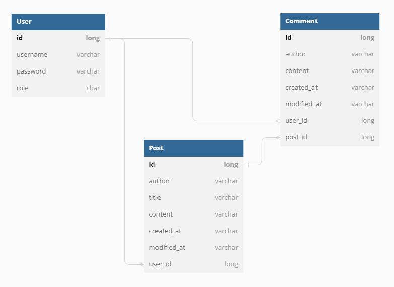
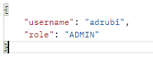
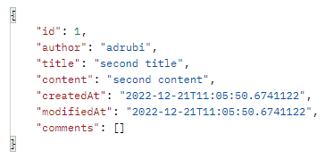
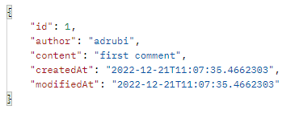
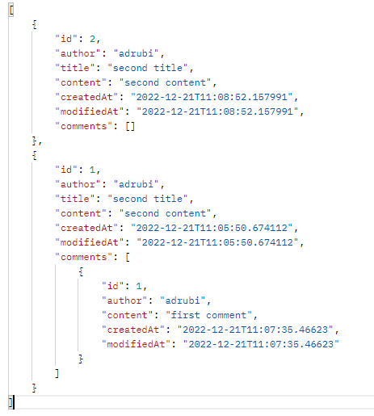
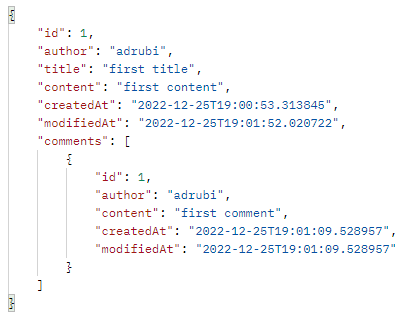
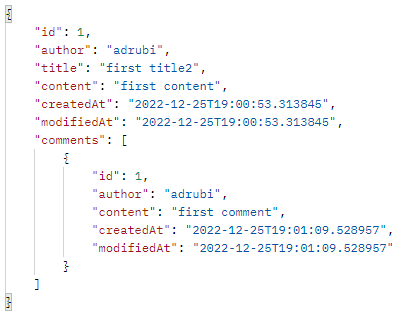
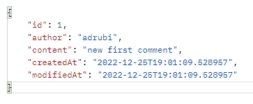
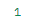
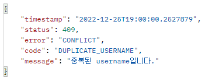

# README

## 💡 Introduce

> 22.12.19 ~ 22.12.21

Spring으로 로그인 기능이 추가된 블로그를 구현합니다.

* 회원가입 / 로그인
* 전체 게시글 목록 조회
* (회원) 게시글 작성
* (회원) 선택한 게시글 조회
* (작성자) 선택한 게시글 수정, 삭제
* (회원) 댓글 조회, 작성
* (작성자) 선택한 댓글 수정, 삭제
* 예외처리

 

## ⚙ Tool

    
    
    
    
    

 

## 📌 ERD

 

## 📃 API 명세

| 기능                  | Method | URL                          | Request                                                      | Response                                                     |
| :-------------------- | :----- | :--------------------------- | :----------------------------------------------------------- | :----------------------------------------------------------- |
| 회원가입              | POST   | /api/user/signup             | { "username": "user1", "password": "password1"}      | { "username": "adrubi2", "role": "ADMIN" }       |
| 로그인                | POST   | /api/user/login              | { "username": "user1", "password": "password1"}      | { "username": "adrubi2", "role": "ADMIN" }       |
| 전체 게시글 목록 조회 | GET    | /api/posts                   | -                                                            | {  {  "id": 1, "author": "username2"  "title": "title2",  "content": "content2",  "createdAt": "2022-07-25T12:43:01.226062”,  "modifiedAt": "2022-07-25T12:43:01.226062”,  "comments": [ {  "id": 1, "author": "username2"  "content": "content2",  "createdAt": "2022-07-25T12:43:01.226062”,  "modifiedAt": "2022-07-25T12:43:01.226062”,  },  …  ]}, {  "id": 1, "author": "username1"  "title": "title1",  "content": "content1",  "createdAt": "2022-07-25T12:43:01.226062”,  "modifiedAt": "2022-07-25T12:43:01.226062”,   "comments": [] },  …  } |
| 선택한 게시글 조회    | GET    | /api/post/{id}               | JWT Token                                                    | {  {  "id": 1, "author": "username2"  "title": "title2",  "content": "content2",  "createdAt": "2022-07-25T12:43:01.226062”,  "modifiedAt": "2022-07-25T12:43:01.226062”,  "comments": [ {  "id": 1, "author": "username2"  "content": "content2",  "createdAt": "2022-07-25T12:43:01.226062”,  "modifiedAt": "2022-07-25T12:43:01.226062”,  },  …  ]}  |
| 게시글 작성           | POST   | /api/post                    | JWT Token, { "title" : "title",  "content" : "content",  } | {  "id": 1, "author": "username2"  "title": "title2",  "content": "content2",  "createdAt": "2022-07-25T12:43:01.226062”,  "modifiedAt": "2022-07-25T12:43:01.226062”,  } |
| 선택한 게시글 수정    | PUT    | /api/post/{id}               | JWT Token, { "title" : "new title",  "content" : "new content",  } | {  "id": 1, "author": "username2"  "title": "new title2",  "content": "new content2",  "createdAt": "2022-07-25T12:43:01.226062”,  "modifiedAt": "2022-07-25T12:43:01.226062”,  "comments": [ {  "id": 1, "author": "username2"  "content": "content2",  "createdAt": "2022-07-25T12:43:01.226062”,  "modifiedAt": "2022-07-25T12:43:01.226062”,  },  …  ]} |
| 선택한 게시글 삭제    | DELETE | /api/post/{id}               | JWT Token                                                    | 1(id return)                                                 |
| 댓글 작성             | POST   | /api/comment?post_id={id}    | JWT Token, { content" : " content",  }           | {  "id": 1, "author": "username2"  "content": "comment",  "createdAt": "2022-07-25T12:43:01.226062”,  "modifiedAt": "2022-07-25T12:43:01.226062” } |
| 선택한 댓글 수정      | PUT    | /api/comment?comment_id={id} | JWT Token, { content" : " new content",  }       | {  "id": 1, "author": "username2"  "content": "new comment",  "createdAt": "2022-07-25T12:43:01.226062”,  "modifiedAt": "2022-07-25T12:43:01.226062” } |
| 선택한 댓글 삭제      | DELETE | /api/comment?comment_id={id} | JWT Token                                                    | 1(id return)                                                 |
| 예외처리              |        |                              |                                                              | {  "timestamp": "2022-12-25T19:00:00.2527879"  "status": 409,  "error": "CONFLICT",  "code": "DUPLICATE_USERNAME",  "message": "중복된 username입니다."  } |

 

## 📷 Result - POSTMAN

### 회원가입 / 로그인

> 회원가입 시, 사용자 이름, 권한 반환 / 로그인 시, 토큰도 함께 반환

 

### 게시글 생성

> 생성한 게시글 반환

 

### 댓글 생성

> 생성한 댓글 반환

 

### 모든 게시글 조회

> 모든 게시글과 함께 각 게시글의 댓글도 함께 반환

 

### 선택한 게시글 조회

> 선택한 게시글과 함께 해당 게시글의 댓글도 함께 반환

 

### 선택한 게시글 수정

> 수정된 게시글 내용 반환

 

### 선택한 게시글 삭제

> 삭제된 게시글의 id값 반환

 

### 선택한 댓글 수정

> 수정된 댓글 내용 반환

 

### 선택한 댓글 삭제

> 삭제된 댓글의 id값 반환

 

### 예외처리

> 해당 예외의 발생 시점, status, error code, message 반환

 

## 📝 Answer a question

​	**A1. 처음 설계한 API 명세서에 변경사항이 있었나요?  변경 되었다면 어떤 점 때문 일까요? 첫 설계의 중요성에 대해 작성해 주세요!**

​	=> Response에서 변경사항이 있었습니다. 첫 설계에서는 주어진 요구사항인 요청에 대한 응답으로 성공 메시지와 상태코드를 반환하라는 점을 반영하지 못했고 구현하며 이 부분을 수정했습니다. 하지만, 대부분 첫 설계와 비슷해서 명세서를 바탕으로 구현해서 parameter나 api 작성 시 수월했습니다.

 

​	**A2. ERD를 먼저 설계한 후 Entity를 개발했을 때 어떤 점이 도움이 되셨나요?** 

​	=> Entity를 구현할 때 Column이 대부분 정해져서 도움이 되었습니다. 특히, 객체들간의 연관관계에 대한 부분이 혼동 없이 구현할 수 있었습니다.

 

​	**A3. JWT를 사용하여 인증/인가를 구현 했을 때의 장점은 무엇일까요?**

​	=> HTTP 헤더에 넣어서 쉽게 전달 가능합니다.

​	=> Cookie, Session 사용 시 서버는 클라이언트의 상태를 저장하지 않아야 하지만 세션 저장소라는 곳에서 클라이언트의 상태를 저장하게 되는 문제점을 해결해 `stateful`이 아닌 `stateless`하게 구현할 수 있습니다.

 

​	**A4. 반대로 JWT를 사용한 인증/인가의 한계점은 무엇일까요?**

​	=> 모든 요청에 토큰이 포함되어 트래픽 크기에 영향을 줍니다.

​	=> 토큰에 정보가 많아져 토큰의 크기가 커지면 네트워크에 부하를 줄 수 있습니다.

​	=> 토큰은 암호화된 게 아니라 `BASE64`로 인코딩된 것으로 중간에 토큰을 탈취하면 데이터를 모두 볼 수 있습니다.

 

​	**A5. 만약 댓글 기능이 있는 블로그에서 댓글이 달려있는 게시글을 삭제하려고 한다면 무슨 문제가 발생할까요? Database 테이블 관점에서 해결방법이 무엇일까요?**

​	=> 게시글에 달린 댓글이 삭제되지 않을 수 있습니다.

​	=> `casecade` 옵션을 통해 연관된 엔티티의 처리를 추가합니다.

 

**A6. 5번과 같은 문제가 발생했을 때 JPA에서는 어떻게 해결할 수 있을까요?**

=> `@OneToMany`의 어노테이션에 `cascade = CascadeType.REMOVE)` 조건을 추가합니다.

 

**A7. IoC / DI 에 대해 간략하게 설명해주세요!**

=> IoC : 제어의 역전, 메소드나 객체의 호출작업을 개발자가 결정하는 것이 아니라 외부에서 결정되는 것입니다. 객체의 의존성을 역전시켜서 객체 간의 결합도를 줄이고 유연한 코드를 작성할 수 있어 가독성, 코드 중복, 유지 보수를 편하게 할 수 있습니다.

​	=> DI : 의존성 주입, 객체를 직접 생성하는 게 아니라 외부에서 생성한 후 주입 시켜주는 방식으로 모듈 간의 결합도가 낮아지고 유연성이 높아집니다.
